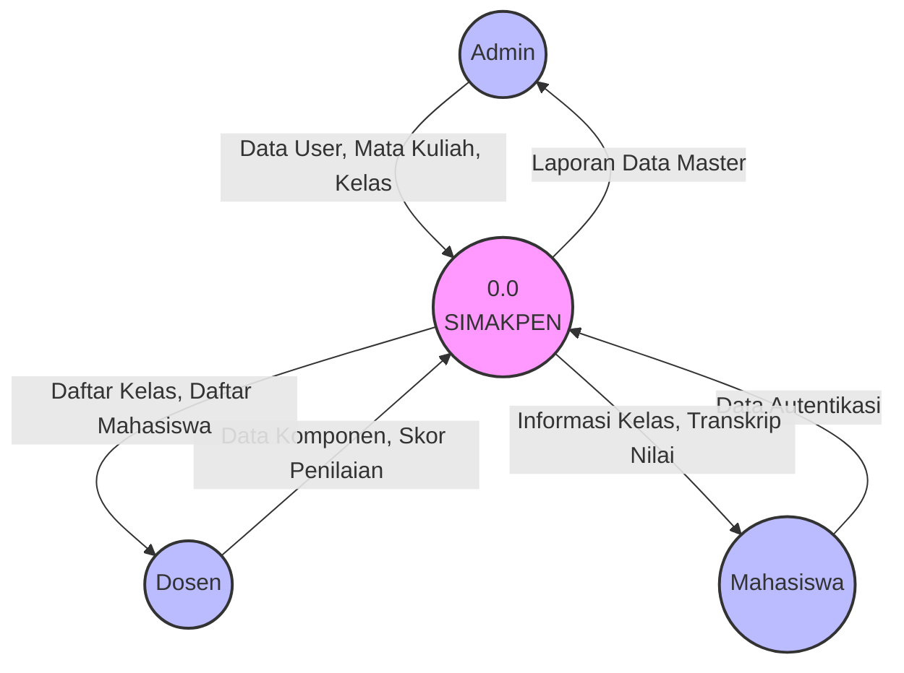
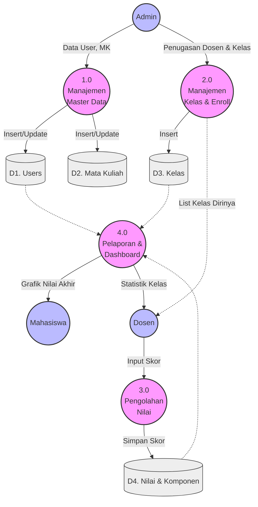
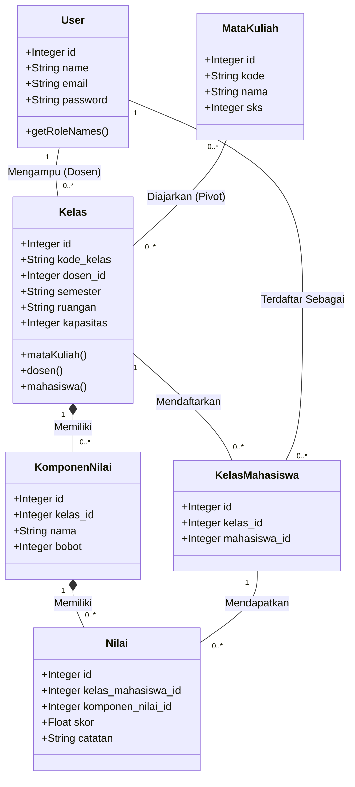

# Dokumentasi SIMAKPEN (Sistem Informasi Manajemen Kelas & Penilaian)

SIMAKPEN adalah sebuah sistem berbasis web yang dibangun menggunakan **Laravel 11**, **React**, dan **Inertia.js**. Sistem ini bertujuan untuk memfasilitasi pengelolaan kelas dan proses penilaian mahasiswa secara terpusat, dengan menerapkan *Role-Based Access Control* (RBAC) untuk tiga entitas pengguna utama: Admin, Dosen, dan Mahasiswa.

## Arsitektur & Teknologi
- **Backend Front-facing**: Laravel 11 (Routing, Middleware, Eloquent ORM, Controllers).
- **Frontend SPA**: React dengan Inertia.js (Meniadakan kebutuhan *full page reload* namun tetap mempertahankan pola MVC Laravel).
- **Styling UI**: Tailwind CSS dengan komponen berbasis Shadcn UI.
- **Role Management**: Spatie Laravel Permission.

---

## 1. Use Case Diagram
Diagram ini memvisualisasikan fungsionalitas utama yang dapat diakses oleh masing-masing *actor* (Admin, 
Dosen, Mahasiswa) di dalam sistem.


graph LR
    subgraph Actors
        A[Admin]
        D[Dosen]
        M[Mahasiswa]
    end

    subgraph SIMAKPEN
        UC1(Login / Autentikasi)
        UC2(Manajemen Pengguna)
        UC3(Manajemen Mata Kuliah)
        UC4(Manajemen Kelas)
        UC5(Lihat Jadwal & Kelas Diampu)
        UC6(Manajemen Komponen Nilai)
        UC7(Input & Rekap Nilai)
        UC8(Lihat Grafik Nilai Akhir)
        UC9(Melihat Rincian Nilai per Komponen)
    end

    A --- UC1
    A --- UC2
    A --- UC3
    A --- UC4
    
    D --- UC1
    D --- UC5
    D --- UC6
    D --- UC7
    
    M --- UC1
    M --- UC8
    M --- UC9


## 2. Activity Diagram (Proses Penilaian)
Diagram aktivitas berikut menjelaskan alur spesifik saat seorang **Dosen** melakukan penginputan nilai untuk mahasiswanya.

```mermaid
flowchart TD
    Start((Mulai)) --> Login[Dosen Login]
    Login --> Dashboard[Akses Dashboard Dosen]
    Dashboard --> MenuInput[Masuk ke Menu 'Input & Rekap Nilai']
    MenuInput --> PilihKelas[Pilih Kelas yang Diampu]
    PilihKelas --> PilihKomponen[Pilih Komponen Nilai<br/>e.g. UTS, UAS, Tugas]
    
    PilihKomponen --> KondisiValidasi{Komponen<br/>Valid?}
    
    KondisiValidasi -- Tidak --> SetupKomponen[Arahkan ke Setup Komponen Nilai]
    SetupKomponen --> PilihKomponen
    
    KondisiValidasi -- Ya --> FormNilai[Sistem Menampilkan Daftar Mahasiswa]
    FormNilai --> InputLoop[Dosen Memasukkan Skor (0-100) per Mahasiswa]
    
    InputLoop --> Submit[Klik Tombol Simpan]
    Submit --> SaveDB[(Simpan ke Database)]
    SaveDB --> Sukses[Sistem Menampilkan <br/>Notifikasi Berhasil]
    Sukses --> Finish((Selesai))
```

---

## 3. Data Flow Diagram (DFD)

### DFD Level 0 (Context Diagram)
Diagram ini menunjukkan batasan sistem (*system scope*) dan bagaimana entitas eksternal berinteraksi dengan SIMAKPEN sebagai satu kesatuan proses.



### DFD Level 1
Merupakan penjabaran dari proses 0.0 di atas, membaginya ke dalam proses-proses logik operasional aplikasi.



---

## 4. Class Diagram
Diagram ini memodelkan struktur basis data secara *Object-Oriented*, mencerminkan model Eloquent yang digunakan dalam Laravel.



---

## 5. Skema Migrasi Database

SIMAKPEN memiliki struktur tabel relasional terpusat yang didefinisikan melalui Laravel Migration (`database/migrations/`). Berikut adalah entitas utama, tipe properti, beserta constraint dari tiap tabel pendukung sistem:

### 1. Tabel Utama: `users` (Aktor Sistem)
Tabel asli bawaan Laravel yang dimodifikasi (menggunakan Schema Table update) untuk menyimpan identitas pengguna berdasarkan *roles* (Spatie).
- `id` (Primary Key, Unsigned Big Integer)
- `name` (String) - Nama lengkap
- `email` (String, Unique)
- `password` (String, Hashed)
- `nim` (String, Opsional, Unique) - Nomor Induk Mahasiswa. Khusus Mahasiswa.
- `nidn` (String, Opsional, Unique) - NIDN Nasional. Khusus Dosen.

### 2. Pustaka Induk: `mata_kuliah`
Dikelola oleh Admin, menampung seluruh daftar kurikulum mata kuliah.
- `id` (Primary Key)
- `kode` (String, Unique) - Identifikasi khusus misal "IF101".
- `nama` (String) - Misal "Pemrograman Web".
- `sks` (TinyInteger) - Bobot akademik.
- `deskripsi` (Text, Opsional)

### 3. Ruang Lingkup Akademik: `kelas`
Dikelola oleh Admin sebagai ruang tempat proses *grading* berlangsung. Secara teknis, Kelas adalah irisan antara Dosen Pengampu pada suatu Semester.
- `id` (Primary Key)
- `kode_kelas` (String, Unique) - Identifikasi unik misal "IF101-A".
- **`dosen_id`** (Foreign Key -> `users.id` berkaskade).
- `semester` (String) - Keterangan periodik.
- `ruangan` (String, Opsional)
- `jadwal` (String, Opsional)
- `kapasitas` (Integer, Default: 40)
- `status` (Enum: `aktif`, `selesai`, `dibatalkan`)

### 4. Relasi Pivot: `kelas_mata_kuliah`
Mengatasi batasan di mana satu kelas mungkin mencakup beberapa mata kuliah terintegrasi, atau sebaliknya.
- `id` (Primary Key)
- `kelas_id` (Foreign Key -> `kelas.id`)
- `mata_kuliah_id` (Foreign Key -> `mata_kuliah.id`)
> **Constraint Utama**: Pasangan `kelas_id` dan `mata_kuliah_id` bersifat `Unique` (Tak boleh ganda).

### 5. Entitas Enrolmen: `kelas_mahasiswa`
Tabel *pivot* relasional yang mengikat seorang Mahasiswa (User) ke dalam Kelas yang dibuka Admin. Ini menjadi pilar utama sistem grading.
- `id` (Primary Key)
- `kelas_id` (Foreign Key -> `kelas.id`)
- `mahasiswa_id` (Foreign Key -> `users.id`)
> **Constraint Utama**: Pasangan `kelas_id` dan `mahasiswa_id` secara gabungan adalah `Unique` agar tak terjadi entri enrolmen duplikat.

### 6. Matriks Penilaian: `komponen_nilai`
Dibuat oleh seorang Dosen, sebagai instrumen ukur yang harus dilalui seluruh mahasiswa terdaftar di suatu kelas.
- `id` (Primary Key)
- `kelas_id` (Foreign Key -> `kelas.id`) - Komponen terikat per kelas, bukan generic system-wide.
- `nama` (String) - Nama item penilaian (Tugas Tengah Semester, Ujian Praktek, dsb).
- `bobot` (Decimal: 5 digit total, 2 desimal) - Mewakili rasio persentase.

### 7. Hasil Akhir Sistem: `nilai`
Tabel transaksi berkecepatan tinggi tempat nilai mahasiswa disimpan. Entitas ini tidak langsung mencatat "Mahasiswa A", melainkan merujuk ke record kelulusan mereka di `kelas_mahasiswa`.
- `id` (Primary Key)
- `kelas_mahasiswa_id` (Foreign Key -> `kelas_mahasiswa.id`)
- `komponen_nilai_id` (Foreign Key -> `komponen_nilai.id`)
- `skor` (Decimal: 5 digit total, 2 desimal) - Skala objektif (misal `85.50`).
- `catatan` (Text, Opsional) - Berisi justifikasi/feedback kualitatif dari sang Dosen kepada mahasiswa terkait.
> **Constraint Utama**: Kombinasi `kelas_mahasiswa_id` dan `komponen_nilai_id` diset `Unique` agar komponen X bagi user Y tidak terisi 2 kali secara sistematis.

